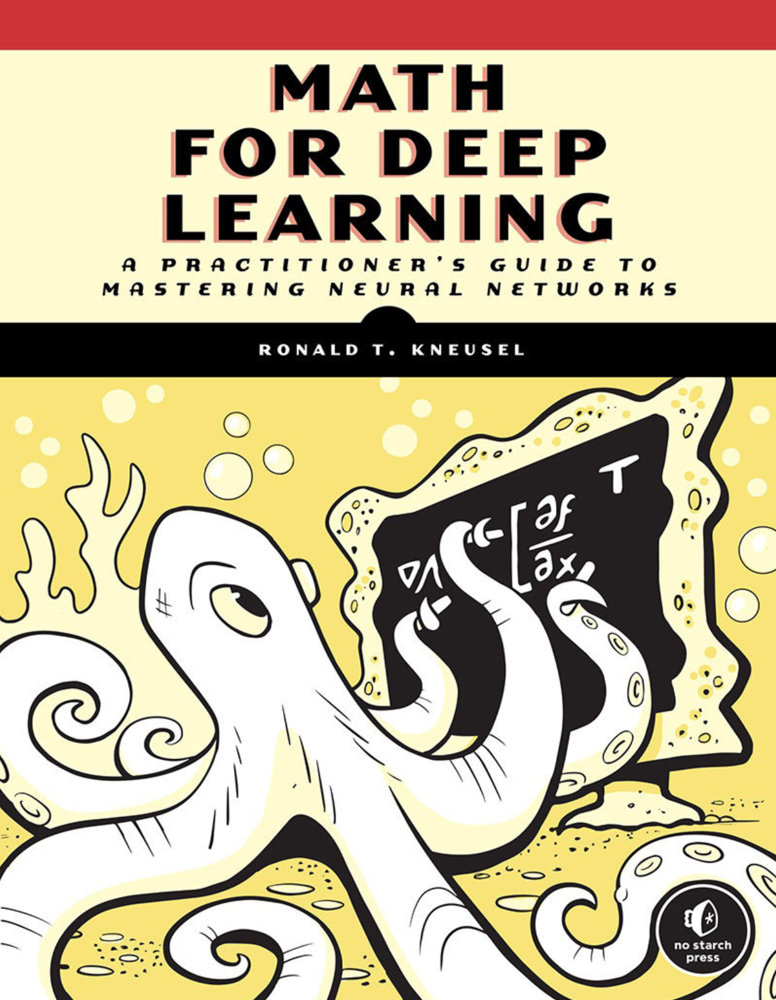

# Math for Deep Learning – Mini Projects

This repository contains mini projects based on the chapters of the book **Math for Deep Learning**.  
Each chapter includes a simple implementation to practice the mathematical concepts from the book.
